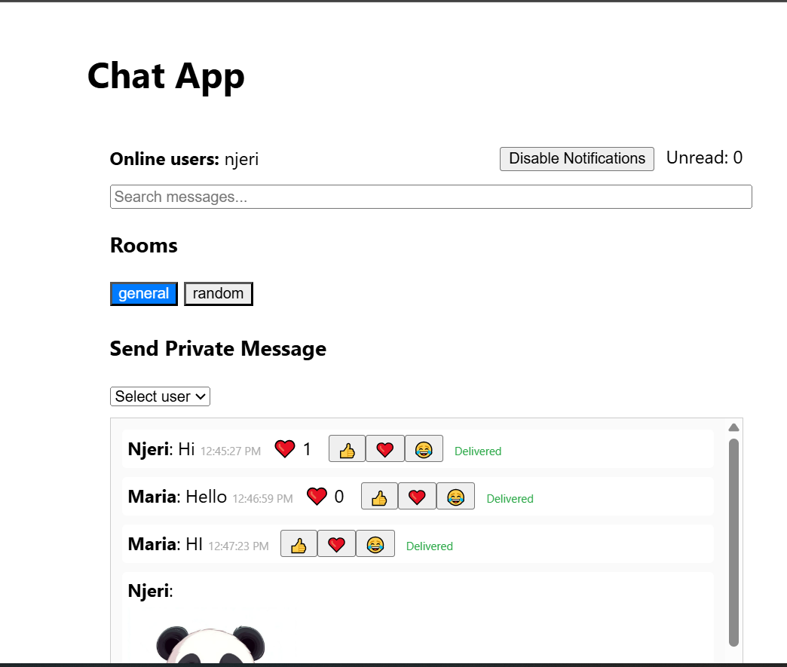
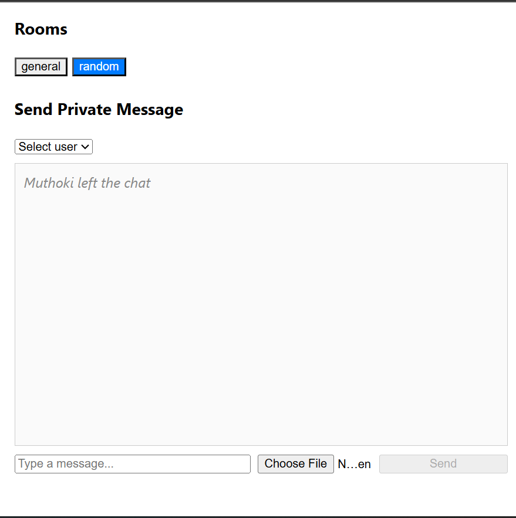

# Real-Time Chat App

## Project Overview
This is a real-time chat application built with React (client) and Node.js/Express/Socket.io (server). It supports public and private messaging, file/image sharing, reactions, notifications, and more. The app demonstrates bidirectional communication and real-time features suitable for modern chat platforms.

---

## Setup Instructions

### 1. **Clone Your Repository**
```
git clone <your-github-classroom-repo-url>
cd <repo-folder>
```

### 2. **Install Server Dependencies**
```
cd server
npm install
```

### 3. **Install Client Dependencies**
```
cd ../client
npm install
```

### 4. **Environment Variables**
- Copy `.env.example` to `.env` in both `server` and `client` folders and fill in the required values.
- Never commit your real `.env` files!

### 5. **Run the Application Locally**
- **Start the server:**
  ```
  cd server
  npm run dev
  ```
- **Start the client:**
  ```
  cd ../client
  npm start
  ```
- Open [http://localhost:3000](http://localhost:3000) in your browser.

---

## Features Implemented
- **User authentication** (username-based)
- **Global chat rooms** (general, random)
- **Private messaging** between users
- **Display messages** with sender and timestamp
- **Typing indicators**
- **Online/offline user status**
- **Multiple chat rooms/channels**
- **File/image sharing** (inline images, downloadable files)
- **Message reactions** (👍, ❤️, 😂, toggleable)
- **Read receipts (delivered status)**
- **Real-time notifications** (browser and sound)
- **Unread message count**
- **Message search**
- **Message pagination** (load older messages)
- **Responsive design** (desktop/mobile)
- **Error handling and reconnection logic**

---

## Deployment Instructions

### Backend (Express/Node)
1. Push your code to GitHub.
2. Deploy to [Render](https://render.com/) (or Railway/Heroku):
   - Create a new Web Service.
   - Set the root directory to `server`.
   - Set environment variables (`MONGODB_URI`, `PORT`).
   - Use `npm install` as the build command and `node server.js` as the start command.
3. After deployment, note your backend URL (e.g., `https://your-backend.onrender.com`).

### Frontend (React)
1. Update `client/.env`:
   ```
   REACT_APP_API_URL=https://your-backend.onrender.com
   ```
2. Push changes to GitHub.
3. Deploy to [Vercel](https://vercel.com/) or [Netlify](https://netlify.com/):
   - Connect your repo and select the `client` folder as the root.
   - Set environment variables as needed.
   - Use `npm run build` as the build command.
4. After deployment, note your frontend URL (e.g., `https://your-frontend.vercel.app`).

---

## Live URLs
- **Backend API:** [Add your backend Render/Railway/Heroku URL here]
- **Frontend App:** [Add your frontend Vercel/Netlify URL here]

---

## CI/CD Pipeline
- This project uses GitHub Actions for CI/CD.
- See `.github/workflows/ci.yml` for details.
-  <!-- Replace with your actual screenshot after running the pipeline -->

---

## Monitoring & Maintenance
- **Monitoring setup:** [Describe your monitoring tools and setup here, e.g., UptimeRobot, Sentry, etc.]
- **Health check endpoint:** `/health` (add to your backend if not present)
- **Performance tracking:** [Describe any tools or methods used]
- **Maintenance plan:** [Describe your plan for updates, backups, etc.]

---

## Screenshots
- 
- 
- 
-  <!-- Add your own pipeline screenshot -->

---

## Submission Notes
- Commit and push your code regularly to show progress.
- Ensure both client and server code are included in your repository.
- The instructor will review your submission after autograding is complete.

---

## Credits
- Built with [React](https://reactjs.org/), [Express](https://expressjs.com/), and [Socket.io](https://socket.io/). 